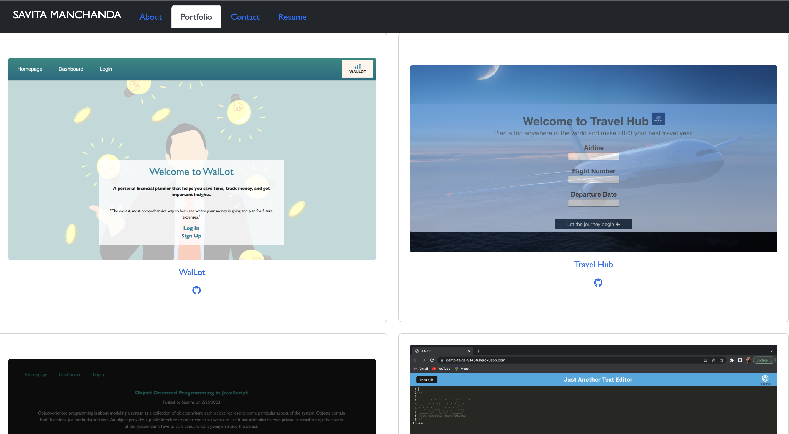
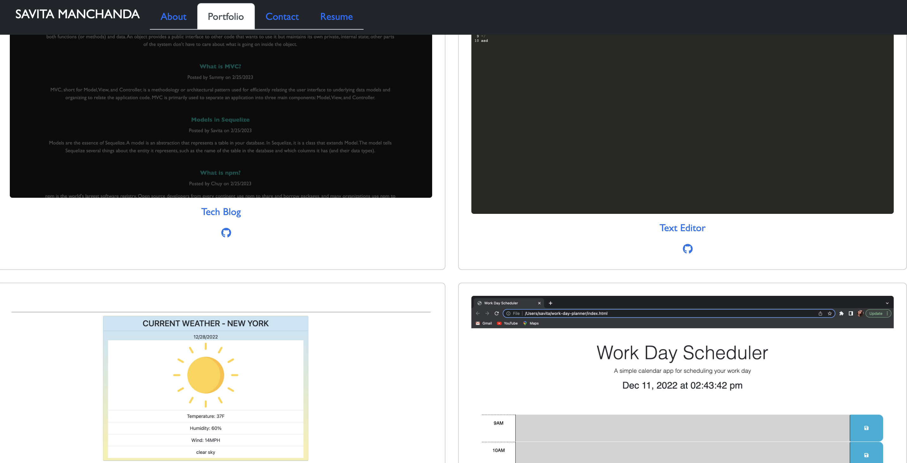
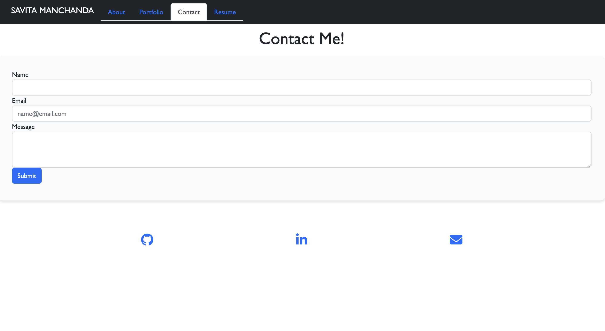
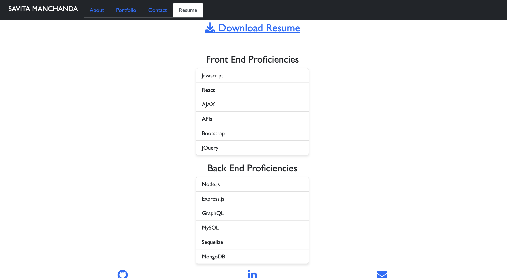

# ReactPortfolio
This is my personal portfolio created using React, showcasing my skills and projects. The portfolio is designed to be clean, and have a minimalistic look and easy-to-navigate structure.


  [](${renderLicenseLink(license))

  ## Table of Contents
  * [Description](#description)
  * [Installation](#installation)
  * [Usage](#usage)
  * [License](#license)
  * [Contribution Guidlines](#contributionguidelines)
  * [Tests](#tests)
  * [Questions](#questions)
  * [Credits](#credits)


  ## Description

 The portfolio is built entirely in React, using functional components and hooks. It is responsive and optimized for viewing on different devices and screen sizes, showcasing some of my recent projects, providing a brief description and links to the live websites and GitHub repositories. The portfolio also includes a section highlighting my technical skills and technologies I am proficient in.

  ## Installation 

  To run the portfolio locally, please follow these steps:

 1. Clone the repository: git clone https://github.com/savitamanchanda/ReactPortfolio

 2. Install dependencies: npm install

 3. Start the development server: npm start

 4. The portfolio should be running on http://localhost:3000/ in your browser.

  ## License 

  https://opensource.org/licenses/MIT

  To learn more about the mit license, click on the URL provided.

  ## Contribution Guidelines

  If you have any suggestions or find any issues, feel free to open a new issue or submit a pull request. Please make sure to follow the existing code style and guidelines.

  ## User Story 

```md
AS AN employer looking for candidates with experience building single-page applications
I WANT to view a potential employee's deployed React portfolio of work samples
SO THAT I can assess whether they're a good candidate for an open position
```

  ## Acceptance Criteria 

```md
GIVEN a single-page application portfolio for a web developer
WHEN I load the portfolio
THEN I am presented with a page containing a header, a section for content, and a footer
WHEN I view the header
THEN I am presented with the developer's name and navigation with titles corresponding to different sections of the portfolio
WHEN I view the navigation titles
THEN I am presented with the titles About Me, Portfolio, Contact, and Resume, and the title corresponding to the current section is highlighted
WHEN I click on a navigation title
THEN I am presented with the corresponding section below the navigation without the page reloading and that title is highlighted
WHEN I load the portfolio the first time
THEN the About Me title and section are selected by default
WHEN I am presented with the About Me section
THEN I see a recent photo or avatar of the developer and a short bio about them
WHEN I am presented with the Portfolio section
THEN I see titled images of six of the developer’s applications with links to both the deployed applications and the corresponding GitHub repositories
WHEN I am presented with the Contact section
THEN I see a contact form with fields for a name, an email address, and a message
WHEN I move my cursor out of one of the form fields without entering text
THEN I receive a notification that this field is required
WHEN I enter text into the email address field
THEN I receive a notification if I have entered an invalid email address
WHEN I am presented with the Resume section
THEN I see a link to a downloadable resume and a list of the developer’s proficiencies
WHEN I view the footer
THEN I am presented with text or icon links to the developer’s GitHub and LinkedIn profiles, and their profile on a third platform (Stack Overflow, Twitter)
```

  ## Questions 

  For any questions, Please reach out at: 

  * GitHub: http://github.com/savitamanchanda
  * Email: manchandasavita3@gmail.com

  ## Links to the Deployed Application 

  * The URL of the deployed application - https://savitamanchanda.github.io/ReactPortfolio/

  * The URL of the GitHub repository - https://github.com/savitamanchanda/ReactPortfolio

  
  
  
  
  
  